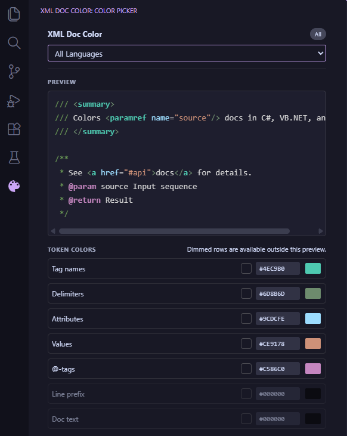

# XML Doc Color

Bring your XML documentation comments to life. **XML Doc Color** uses semantic highlighting to give distinct colors to every part of a doc comment — tag names, delimiters, attributes, values, `@`-tags, prefixes, and plain text — across 8 languages.

---

## Features

- **Semantic highlighting** for XML doc comments (`///`, `'''`, `/** */`) across 8 languages
- **7 individually configurable token types** — fully customizable via the sidebar Color Picker or your theme JSON
- **Sidebar Color Picker** — per-language color overrides with live preview, reset per language, and instant apply
- **Two bundled themes** — *XML Doc Color Dark* and *XML Doc Color Light* for explicit, zero-config color control
- **`xmlDocColor.enabled` setting** — disable the extension entirely without uninstalling

---

## Supported Languages

| Language | Comment style | Doc format |
|---|---|---|
| C# | `///` | XML doc comments |
| F# | `///` | XML doc comments |
| VB.NET | `'''` | XML doc comments |
| Java | `/** … */` | Javadoc |
| TypeScript | `/** … */` | TSDoc / JSDoc |
| JavaScript | `/** … */` | JSDoc |
| PHP | `/** … */` | PHPDoc |
| Kotlin | `/** … */` | KDoc |

---

## Token Colors

All 7 token types inherit from a standard VS Code token type so they work out of the box with any theme. Each can be overridden individually.

| Token type | Colors | Inherits from |
|---|---|---|
| `xmlDocTagName` | `
`, `<param>`, `<returns>` … | `type` |
| `xmlDocTagDelimiter` | `<`, `>`, `</`, `/>`, `<!--`, `-->` | `operator` |
| `xmlDocAttribute` | `name`, `cref`, `href` … | `property` |
| `xmlDocAttributeValue` | `"paramName"` … | `string` |
| `xmlDocAtTag` | `@param`, `@returns`, `@link` … | `keyword` |
| `xmlDocLinePrefix` | `///`, `'''`, `*`, `/**`, `*/` | `comment` |
| `xmlDocText` | Plain text between tags | `comment` |

---

## Color Picker

Open the sidebar panel via the **XML Doc Color** icon in the Activity Bar, or run **XML Doc Color: Open Color Picker** from the Command Palette (`Ctrl+Shift+P`).

- Pick a language from the dropdown
- Adjust any token color using the color inputs
- Hit **Apply** to write the colors to your VS Code settings instantly
- Use **Reset** to revert a language back to global defaults

---

## Bundled Themes

Two optional themes are bundled for immediate, zero-config color control:

- **XML Doc Color Dark** — optimized for dark environments
- **XML Doc Color Light** — optimized for light environments

Select them via *File → Preferences → Color Theme* (or `Ctrl+K Ctrl+T`).

---

## Settings

| Setting | Type | Default | Description |
|---|---|---|---|
| `xmlDocColor.enabled` | `boolean` | `true` | Enable or disable XML doc comment colorization entirely |

---

## Commands

| Command | Description |
|---|---|
| `XML Doc Color: Open Color Picker` | Opens the sidebar Color Picker panel |

---

## Links

- [GitHub Repository](https://github.com/Sato-Isolated/xml-doc-color)
- [Report an Issue](https://github.com/Sato-Isolated/xml-doc-color/issues)
- [Changelog](https://github.com/Sato-Isolated/xml-doc-color/blob/main/CHANGELOG.md)

---

Made by [MindLated](https://github.com/Sato-Isolated)

